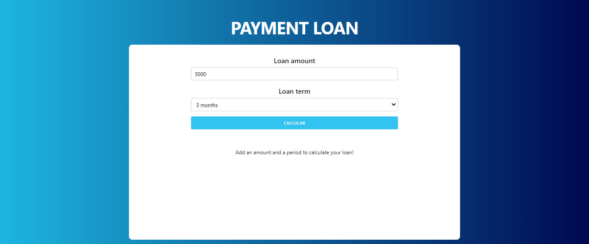
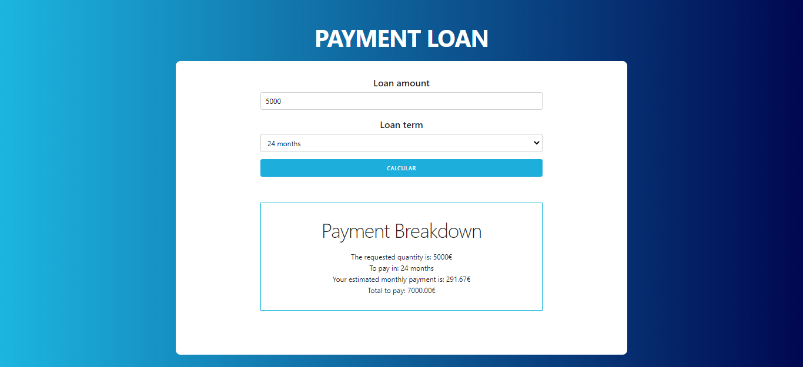

# Payment Loan

This application made with React is used to calculate a monthly estimate that you would have to pay if you asked for a loan. The higher the amount borrowed, the lower the interest and the longer the time to pay, the higher the interest.

## Display

## Spinner
The spinner used belongs to Tobias Ahlin and his spinners can be found on his [SpinKit website](https://tobiasahlin.com/spinkit/).
